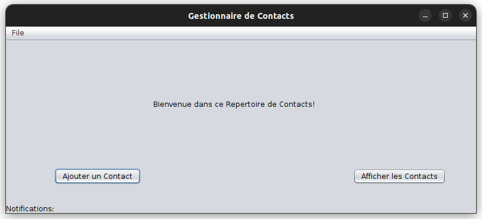
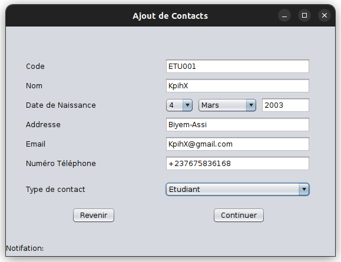
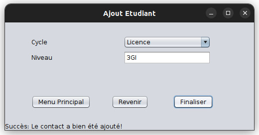
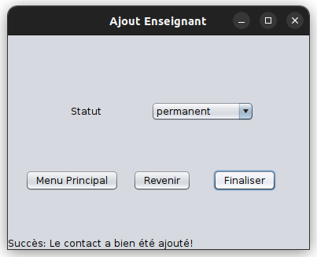
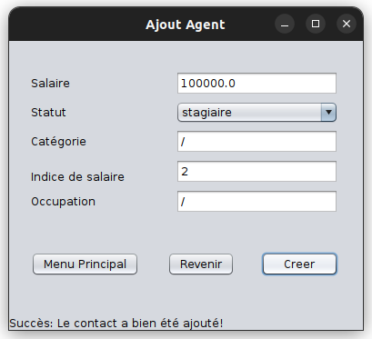
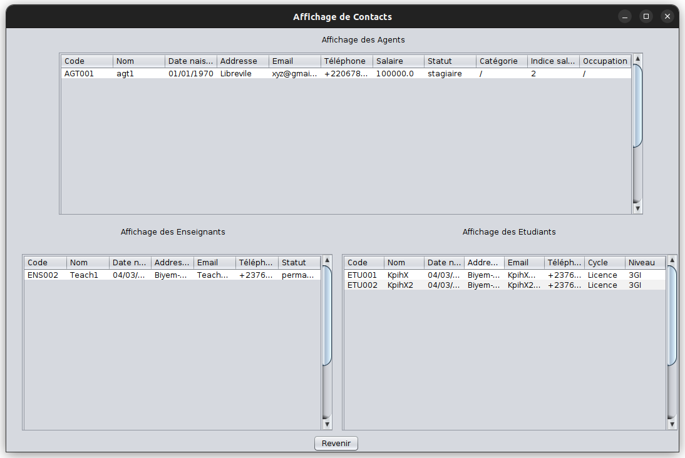
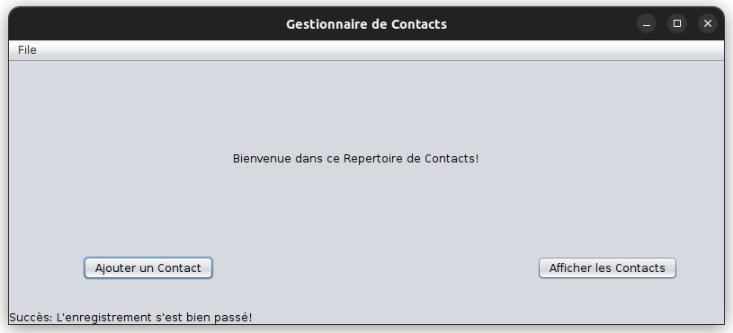

# Contacts Manager 🗂️

Ce projet réalisé en Java, offre une interface graphique pour gerer un repertoire de contacts (Agents, Enseignants, Etudiants); avec même la possibilité de les enregirstrer dans une base de données, en vue d'une persistance des données

## Fonctionnalités 🛠️

- Le projet offre une interface graphique pour gérer l'ajout de contacts dans un repertoire
- Il offre aussi un affichage graphique des repertoires par catégorie de contacts
- Il offre aussi des interfaces cmd pour des tests
- Il propose enfin la persistance des données via l'utilisation d'une base de données MySQL

## Dépendances 📦

- Ce projet dépend comme on peut le voir dans pom.xml de *mysql-connector-j version 8.2.0* qui est déjà présent dans le projet.

- Le script de création de la BD se trouve dans `src/main/ressources` et se nomme `schema_deb.sql.`

## Execution 🚀

Le est réalisé avec l'outil maven; et donc peut être ouvert et reconfiguré et retesté avec la plupart des IDEs java (NetBeans (celui qui a permis la réalisation), IntelliJ Idea, VSCode ...)

Pour juste l'exécuter, il faut:

- ouvrir un termanal dans le repertoire du projet
- faire `cd target`
- puis `java -jar contacts-manager.jar` (Pour lancer l'application)

## Exemples d'utilisation 🚀

### Interface d'Accueil

### Ajout Contact

### Ajout Étudiant

### Ajout Enseignant

### Ajout Agent

### Affichage Contacts

### Enregistrement dans la BD

### Author ✍️

Ce peojet a été réalisé l'étudiant: **KAMDEM POUOKAM Ivann Harold du 3GI à l'ENSPY.**

## License 📄

This project is under the MIT license - see the LICENSE file for details.

🔗: https://github.com/KpihX/contacts-manager
